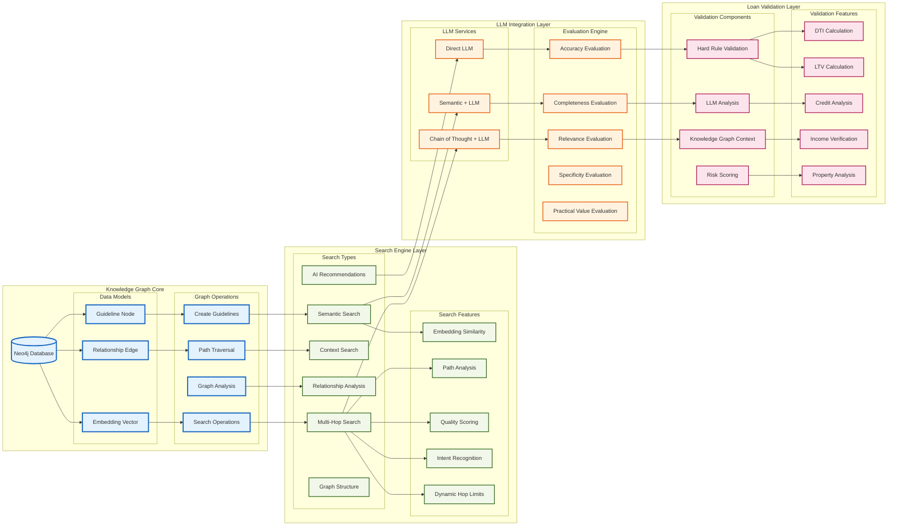
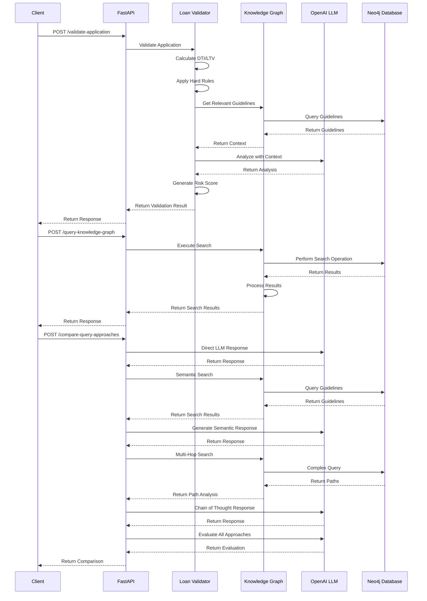
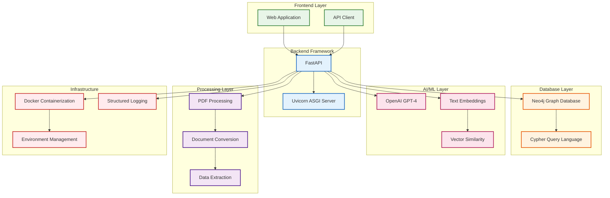

# Knowledge Graph Based Loan Validator and Querying System - Architecture

## System Overview
This system combines FastAPI, Neo4j knowledge graph, and OpenAI LLM to provide intelligent loan application validation and sophisticated knowledge querying capabilities.

## Architecture Diagram

```mermaid
graph TB
    %% External Clients
    subgraph "External Clients"
        WEB[Web Application]
        API_CLIENT[API Client]
        MOBILE[Mobile App]
    end

    %% API Gateway Layer
    subgraph "API Gateway & Load Balancer"
        LB[Load Balancer]
        API_GATEWAY[API Gateway]
    end

    %% FastAPI Application Layer
    subgraph "FastAPI Application Layer"
        FASTAPI[FastAPI Application]
        
        subgraph "API Endpoints"
            VALIDATE[/validate-application]
            QUERY[/query-knowledge-graph]
            COMPARE[/compare-query-approaches]
            PROCESS[/process-documents]
            STATS[/knowledge-graph-stats]
            HEALTH[/health]
        end
        
        subgraph "Middleware"
            CORS[CORS Middleware]
            LOGGING[Request Logging]
            AUTH[Authentication]
        end
    end

    %% Core Services Layer
    subgraph "Core Services Layer"
        subgraph "Loan Processing Services"
            PDF_PROC[PDF Processor]
            LOAN_CONV[Loan Converter]
            LOAN_VAL[Loan Validator]
        end
        
        subgraph "Knowledge Graph Services"
            NEO4J_SERVICE[Neo4j Knowledge Graph Service]
            SEMANTIC_SEARCH[Semantic Search]
            MULTI_HOP[Multi-Hop Search]
            CONTEXT_SEARCH[Context Search]
            RELATIONSHIP_ANALYSIS[Relationship Analysis]
            AI_RECOMMENDATIONS[AI Recommendations]
        end
        
        subgraph "LLM Integration"
            OPENAI_CLIENT[OpenAI Client]
            CHAIN_OF_THOUGHT[Chain of Thought Reasoning]
            RESPONSE_GENERATION[Response Generation]
            EVALUATION_ENGINE[Evaluation Engine]
        end
    end

    %% Data Layer
    subgraph "Data Layer"
        subgraph "Neo4j Knowledge Graph"
            NEO4J[(Neo4j Database)]
            GUIDELINES[(Guidelines)]
            RELATIONSHIPS[(Relationships)]
            EMBEDDINGS[(Embeddings)]
        end
        
        subgraph "File Storage"
            UPLOADS[Upload Directory]
            TEMP_FILES[Temp Files]
        end
        
        subgraph "Configuration"
            ENV_VARS[Environment Variables]
            CONFIG[Configuration Files]
        end
    end

    %% External Services
    subgraph "External Services"
        OPENAI_API[OpenAI API]
        EMBEDDING_API[Embedding API]
    end

    %% Connections
    WEB --> LB
    API_CLIENT --> LB
    MOBILE --> LB
    
    LB --> API_GATEWAY
    API_GATEWAY --> FASTAPI
    
    FASTAPI --> CORS
    FASTAPI --> LOGGING
    FASTAPI --> AUTH
    
    VALIDATE --> LOAN_VAL
    QUERY --> NEO4J_SERVICE
    COMPARE --> NEO4J_SERVICE
    COMPARE --> OPENAI_CLIENT
    PROCESS --> PDF_PROC
    STATS --> NEO4J_SERVICE
    
    LOAN_VAL --> LOAN_CONV
    LOAN_VAL --> NEO4J_SERVICE
    LOAN_VAL --> OPENAI_CLIENT
    
    PDF_PROC --> UPLOADS
    PDF_PROC --> TEMP_FILES
    
    NEO4J_SERVICE --> NEO4J
    SEMANTIC_SEARCH --> NEO4J
    MULTI_HOP --> NEO4J
    CONTEXT_SEARCH --> NEO4J
    RELATIONSHIP_ANALYSIS --> NEO4J
    AI_RECOMMENDATIONS --> NEO4J
    
    NEO4J_SERVICE --> EMBEDDINGS
    SEMANTIC_SEARCH --> EMBEDDINGS
    
    OPENAI_CLIENT --> OPENAI_API
    EMBEDDING_API --> OPENAI_API
    
    CHAIN_OF_THOUGHT --> OPENAI_CLIENT
    RESPONSE_GENERATION --> OPENAI_CLIENT
    EVALUATION_ENGINE --> OPENAI_CLIENT
    
    ENV_VARS --> FASTAPI
    CONFIG --> FASTAPI

    %% Styling
    classDef client fill:#e1f5fe,stroke:#01579b,stroke-width:2px
    classDef api fill:#f3e5f5,stroke:#4a148c,stroke-width:2px
    classDef service fill:#e8f5e8,stroke:#1b5e20,stroke-width:2px
    classDef data fill:#fff3e0,stroke:#e65100,stroke-width:2px
    classDef external fill:#ffebee,stroke:#c62828,stroke-width:2px

    class WEB,API_CLIENT,MOBILE client
    class FASTAPI,VALIDATE,QUERY,COMPARE,PROCESS,STATS,HEALTH,CORS,LOGGING,AUTH api
    class PDF_PROC,LOAN_CONV,LOAN_VAL,NEO4J_SERVICE,SEMANTIC_SEARCH,MULTI_HOP,CONTEXT_SEARCH,RELATIONSHIP_ANALYSIS,AI_RECOMMENDATIONS,OPENAI_CLIENT,CHAIN_OF_THOUGHT,RESPONSE_GENERATION,EVALUATION_ENGINE service
    class NEO4J,GUIDELINES,RELATIONSHIPS,EMBEDDINGS,UPLOADS,TEMP_FILES,ENV_VARS,CONFIG data
    class OPENAI_API,EMBEDDING_API external
```

## Detailed Component Architecture



## Data Flow Architecture



## Technology Stack



## Key Features and Capabilities

### 1. **Knowledge Graph Core**
- **Neo4j Database**: Stores mortgage guidelines as nodes with relationships
- **Embedding Vectors**: Semantic representations for similarity search
- **Graph Traversal**: Multi-hop path discovery and analysis

### 2. **Advanced Search Capabilities**
- **Semantic Search**: Find relevant guidelines using embedding similarity
- **Multi-Hop Search**: Discover connections through multiple guideline relationships
- **Context Search**: Gather comprehensive context around topics
- **Relationship Analysis**: Analyze connections between guidelines
- **AI Recommendations**: Generate actionable recommendations

### 3. **LLM Integration**
- **Direct LLM**: Pure AI responses without knowledge base
- **Semantic + LLM**: Knowledge-enhanced responses
- **Chain of Thought**: Sophisticated reasoning with knowledge graph paths
- **Evaluation Engine**: Comprehensive assessment of response quality

### 4. **Loan Validation System**
- **Hard Rule Validation**: Traditional underwriting rules
- **LLM Analysis**: AI-powered risk assessment
- **Knowledge Graph Context**: Guideline-based validation
- **Risk Scoring**: Comprehensive risk evaluation

### 5. **System Features**
- **RESTful API**: FastAPI-based endpoints
- **Real-time Processing**: Immediate validation and querying
- **Scalable Architecture**: Containerized deployment
- **Comprehensive Logging**: Detailed operation tracking
- **Error Handling**: Robust error management

## Benefits

1. **Intelligent Validation**: Combines traditional rules with AI reasoning
2. **Knowledge Discovery**: Uncovers hidden connections between guidelines
3. **Comprehensive Analysis**: Multi-faceted approach to loan assessment
4. **Scalable Architecture**: Handles high-volume processing
5. **Real-time Insights**: Immediate access to knowledge and validation
6. **Continuous Learning**: System improves with more data and usage 